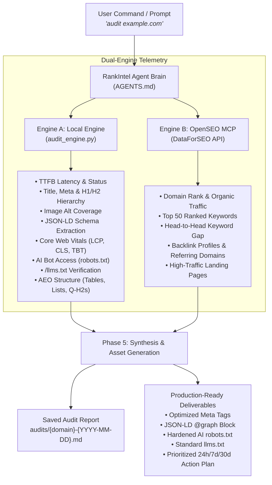

# ⚡ RankIntel

<p align="center">
  <strong>Autonomous Search Intelligence, Technical SEO & Generative Engine Optimization (GEO) Agent</strong>
</p>

<p align="center">
  
  
  
  
  
</p>

---

## 🧭 Overview

**RankIntel** is an elite, autonomous search intelligence agent built for the modern search landscape. It bridges **traditional Technical SEO**, **Core Web Vitals telemetry**, and **Generative Engine Optimization (GEO / AEO)** to position websites for both traditional engines (Google, Bing) and AI search agents (ChatGPT Search, Perplexity, Claude, Google AI Overviews).

Forget bloated dashboards and manual data copying. Simply prompt your AI agent with a URL or a competitive pair: RankIntel runs telemetry, extracts ground truth, performs gap analysis, and manufactures **copy-paste ready production assets** in seconds.

---

## 🌟 Key Capabilities

- **🚀 Dual-Engine Synergy**: Combines **Engine A** (zero-cost, direct local HTML & PageSpeed crawler) with **Engine B** (real-time SERP, DR, keyword gaps & backlinks via OpenSEO MCP).
- **🤖 Generative Engine Optimization (GEO / AEO)**: Audits crawler access for `GPTBot`, `OAI-SearchBot`, `PerplexityBot`, and `ClaudeBot`. Validates `/llms.txt` presence and checks content extractability (question-based H2s, structured tables, process lists).
- **⚡ Core Web Vitals & Latency Profiling**: Real mobile lab telemetry directly from Google's PageSpeed API (LCP, CLS, TBT) coupled with millisecond-precision local server response time (TTFB).
- **🏗️ Structured Data Discovery & Generation**: Audits existing JSON-LD schemas (`Organization`, `Product`, `ProfessionalService`, `FAQPage`), detects gaps, and produces complete `@graph` schema blocks.
- **⚔️ Automated Competitor Gap Analysis**: Benchmarks target domains against rivals side-by-side to highlight missing keyword targets, structural voids, and speed discrepancies.
- **📋 Zero-Fluff Production Deliverables**: Generates ready-to-deploy `<title>` and `<meta>` tags, syntax-valid JSON-LD markup, standard-compliant `llms.txt`, and hardened `robots.txt` rules.

---

## 🏗️ Architecture & Dual-Engine Workflow

RankIntel employs a synchronized dual-engine architecture orchestrated by the agent brain (`AGENTS.md`):



### Dual-Engine Comparison

| Feature / Metric | Engine A: Local Engine (`audit_engine.py`) | Engine B: OpenSEO MCP (`openseo`) |
| :--- | :--- | :--- |
| **Execution** | Direct local execution (`python audit_engine.py <url>`) | Cloud MCP endpoint (`https://app.openseo.so/mcp`) |
| **Cost** | **Zero Cost** (Direct crawl & Google PageSpeed API) | **Pay-as-you-go** (DataForSEO credits, free trial available) |
| **Technical Telemetry** | HTTP status, TTFB latency, redirect history | Domain Authority, trust scores |
| **On-Page & Schema** | Title/Meta length, H1/H2 hierarchy, Image alts, JSON-LD | Top organic keywords, search volume, CPC, ranking URLs |
| **Performance** | Google PageSpeed Mobile (LCP, CLS, TBT, Performance score) | Traffic trends, SERP visibility |
| **GEO / AEO** | AI bots in `robots.txt`, `/llms.txt` check, Q&A headings | Keyword ranking in AI search features |
| **Competitor Recon** | Standalone side-by-side technical & schema crawl | Live keyword gap, missed ranking opportunities, backlinks |

---

## 🔄 The 5-Phase Autonomous Audit Protocol

When auditing any target URL or performing competitor recon, RankIntel executes a rigorous 5-phase protocol:

1. **Phase 1: Technical & Performance Telemetry**
   - Dispatches `audit_engine.py` to inspect HTTP response codes, redirect chains, and server response TTFB.
   - Queries Google PageSpeed API for mobile Core Web Vitals: LCP (<2.5s), CLS (<0.1), and TBT (<200ms).
2. **Phase 2: On-Page Architecture & Structured Data**
   - Evaluates `<title>` tag (50–60 chars, keyword front-loading) and `<meta name="description">` (140–160 chars, conversion hook).
   - Validates heading hierarchy (single H1, structured H2/H3 nesting) and image `alt` text coverage.
   - Extracts all JSON-LD schema blocks, validates `@graph` structure, and flags absent business/content schemas.
3. **Phase 3: Generative Engine (GEO) & Answer Engine (AEO) Audit**
   - Scans `robots.txt` for explicit access rules covering `GPTBot`, `OAI-SearchBot`, `PerplexityBot`, and `ClaudeBot`.
   - Tests `/llms.txt` availability for LLM context window ingestion.
   - Inspects semantic answer extractability: interrogative H2s, structured data tables, and `<ol>` process sequences.
4. **Phase 4: Competitor Recon & Gap Analysis**
   - Leverages OpenSEO MCP to run `keyword_gap` and discover high-value missed keywords.
   - Benchmarks backlink velocity, referring domains, and anchor profiles.
   - Fallback mode: Crawls competitors directly via Engine A to compare schema and CWV performance side-by-side.
5. **Phase 5: Synthesis & Automated Fix Generation**
   - Compiles comprehensive findings into a timestamped report under `audits/{domain}-{YYYY-MM-DD}.md`.
   - Generates production-ready, copy-paste assets immediately in the response.

---

## 📦 Standard Production Deliverables

Every full audit produces five copy-paste ready assets:

1. **Optimized Meta Tags**:
   - Primary keyword focus.
   - Current Title vs. Optimized Title (50–60 characters) with CTR psychological trigger rationale.
   - Current Description vs. Optimized Description (140–160 characters) with conversion CTA rationale.
2. **JSON-LD Schema Markup**:
   - Single valid `<script type="application/ld+json">` block utilizing `@graph`.
   - Automatically contextualized for `Organization`, `Service`, `Product`, `FAQPage`, or `Article`.
3. **Hardened AI `robots.txt`**:
   - Explicit `Allow: /` rules for key AI search agents (`GPTBot`, `OAI-SearchBot`, `PerplexityBot`, `ClaudeBot`).
4. **Standards-Compliant `llms.txt`**:
   - Built to [llmstxt.org](https://llmstxt.org) specifications: brief markdown project summary blockquote followed by categorized markdown links to key pages.
5. **Prioritized Action Plan**:
   - 🔴 **Critical (24h)**: Showstoppers, missing H1, blocked AI crawlers, broken redirects.
   - 🟠 **High (7d)**: CWV bottlenecks, missing schema, unoptimized meta descriptions.
   - 🟡 **Medium (30d)**: Internal linking optimizations, backlink acquisition targets.
   - 🟢 **GEO / AI Search Wins**: FAQ expansion, table formatting for AI quote extraction, `/llms.txt` deployment.

---

## 💬 Command Reference

When interacting with RankIntel in your AI assistant (Antigravity, Claude Code, etc.), use natural language commands:

| Command | Action |
| :--- | :--- |
| `audit <url>` | Runs full 5-phase SEO & GEO audit; saves report to `audits/` |
| `compare <url1> vs <url2>` | Benchmarks both sites side-by-side; generates gap report in `reports/` |
| `who ranks for <keyword>` | Executes live SERP analysis for the target search query |
| `fix my title and description for <url>` | Extracts current metadata and crafts optimized, CTR-focused replacements |
| `generate schema for <url>` | Scrapes page content and manufactures complete, valid JSON-LD schema |
| `generate llms.txt for <url>` | Crawls core site sections and produces a clean `llms.txt` file |
| `check if <url> is in AI search` | Dedicated GEO audit: crawler permissions, `/llms.txt`, and AEO extractability |
| `find backlink opportunities for <url>` | Discovers high-authority referring domains linking to competitors but not to you |

---

## 💻 Standalone CLI Usage (Engine A)

You can run the local intelligence crawler directly from the terminal. With RankIntel v2.0, you can use the built-in CLI:

```bash
# Activate your virtual environment
source venv/bin/activate   # Linux/macOS
.\venv\Scripts\Activate.ps1 # Windows PowerShell

# Run a multi-engine audit
rankintel audit https://example.com

# (Or use the backward-compatible entry point)
python audit_engine.py https://example.com
```

### CLI Terminal Output Sample

```text
╭──────────────────────────────────────────────────────────────────────────╮
│ RankIntel Intelligence Engine v2.0                                       │
│ Triangulating: advertools (SEO) + crawl4ai (Browser) + RankIntel (GEO)   │
│ Target: https://example.com                                              │
╰──────────────────────────────────────────────────────────────────────────╯
✔ Multi-Engine Triangulation Completed Successfully!

📊 Executive Audit Scorecard
...
Report saved to: audits/example.com-2026-09-30.md
```

---

## 🚀 Quickstart & Setup Guide

### 1. Prerequisites
- **Python 3.10+**
- **Git**
- An MCP-compatible AI environment (Google Antigravity, Claude Code, Cursor, etc.)

### 2. Installation

```bash
# 1. Clone the repository
git clone https://github.com/your-username/RankIntel.git
cd RankIntel

# 2. Create and activate a virtual environment
python -m venv venv
.\venv\Scripts\Activate.ps1    # Windows
source venv/bin/activate       # Linux/macOS

# 3. Install dependencies
pip install -r requirements.txt
```

### 3. OpenSEO & DataForSEO Setup (One-Time)

To enable **Engine B (OpenSEO MCP)** for live SERP data and competitor gaps:

1. **Get Free DataForSEO API Credits**:
   - Register at [dataforseo.com](https://dataforseo.com) (no credit card required).
   - Receive **$1.00 free credit** (~10–15 full comprehensive site audits).
2. **Connect OpenSEO**:
   - Register at [openseo.so](https://openseo.so) ($0.50 free trial).
   - Enter your DataForSEO API credentials in OpenSEO settings.
3. **MCP Configuration**:
   - RankIntel includes a pre-configured `.mcp.json` in the root folder:
   ```json
   {
     "mcpServers": {
       "openseo": {
         "url": "https://app.openseo.so/mcp"
       }
     }
   }
   ```
4. **Authorize**:
   - The first time your AI agent accesses an OpenSEO tool, approve the browser authentication prompt.

#### 💡 DataForSEO Free Credit Economics

| Task | Approximate Cost | Yield on $1.00 Free Tier |
| :--- | :--- | :--- |
| **Domain Overview** | ~$0.01 | ~100 queries |
| **Top 50 Organic Keywords** | ~$0.05 | ~20 queries |
| **Top 100 Backlinks** | ~$0.001 | ~1,000 queries |
| **Site Technical Audit** | ~$0.10 | ~10 sites |
| **Full Competitor Gap Recon** | ~$0.15 | ~6–8 full analyses |

---

## 📂 Project Structure

```text
RankIntel/
├── .gitignore              # Ignores virtualenv, caches, and raw audit outputs
├── .mcp.json               # OpenSEO MCP server configuration
├── AGENTS.md               # RankIntel agent core brain and execution rules
├── README.md               # Project documentation and architecture guide
├── pyproject.toml          # Build configuration and CLI entry points (v2.0)
├── requirements.txt        # Python package dependencies
├── audit_engine.py         # Multi-engine CLI runner & backward-compatible entry point
├── src/                    # Modular engine source code
│   └── rankintel/
│       ├── cli.py          # Click-based CLI entry point (rankintel audit <url>)
│       ├── engines/        # SEO, GEO & Browser DOM extraction engines
│       ├── evidence/       # Evidence collectors & cross-engine conflict detection
│       ├── intelligence/   # Synthesizer & automated fix generator
│       ├── models/         # Pydantic telemetry & schema models
│       ├── references/     # AI crawlers, CWV thresholds & quality gates
│       └── reporters/      # Markdown report synthesis
├── audits/                 # Generated markdown audit reports (timestamped)
└── reports/                # Head-to-head comparison and keyword gap dossiers
```

---

## 🛡️ Resilience & Fallback Protocols

RankIntel is engineered for zero-failure autonomy:

- **No OpenSEO Credits / Offline MCP**: Automatically falls back to Engine A (`audit_engine.py`) and direct web inspection. The agent never halts or demands manual intervention.
- **PageSpeed Rate Limiting (HTTP 429)**: Gracefully records API rate limits in the report and utilizes local high-precision server TTFB latency to evaluate performance.
- **Bot Defense (Cloudflare / HTTP 403)**: Captures response headers, logs bot mitigation systems, and notes firewall characteristics as an architectural finding.

---

## 📄 License

This project is licensed under the [MIT License](LICENSE) — free for personal, commercial, and agency use.
