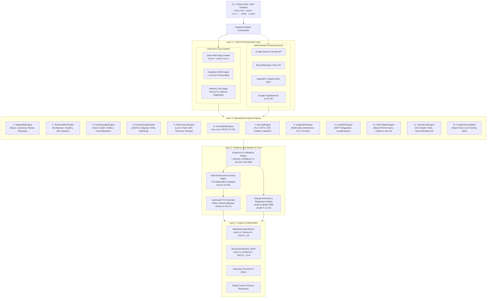

# 📋 RankIntel — Master Capability Roadmap & Engineering Backlog

> **Document Version**: 2.0.0  
> **Status**: Approved Blueprint & Active Backlog  
> **Scope**: Autonomous Multi-Engine Search Intelligence, Technical Crawling, Core Web Vitals, Content Quality, Knowledge Graphs, AI Citations & Automated Fix Generation  
> **Primary Target**: Production-grade CLI, Python SDK, and Model Context Protocol (MCP) Server

---

## 🧭 Executive Vision & Core Philosophy

RankIntel is transitioning from an initial single-page audit agent into an **Autonomous Multi-Engine Search Intelligence Platform**. 

### The Core Principle
```
Old Paradigm: "Does RankIntel's measurement agree with reality?" (Single-page parity)
New Paradigm: "Can RankIntel understand the entire website, search ecosystem, competitive environment,
               and AI visibility well enough to prescribe precise, verifiable production fixes?"
```

RankIntel treats website intelligence not as a single opaque score, but as a multi-dimensional, evidence-backed pipeline:

```
RANKINTEL
    │
    ├─────────────────────────────┼─────────────────────────────┐
    ↓                             ↓                             ↓
DISCOVERY                     ANALYSIS                    INTELLIGENCE
    │                             │                             │
    ├─ Crawl / Index              ├─ Technical SEO              ├─ Competitor Architecture
    ├─ Multi-Page Graph           ├─ Content Depth & Intent     ├─ Keyword Footprint
    ├─ JS Hydration & Rendering   ├─ JSON-LD Schema Graphs      ├─ Backlink Authority
    ├─ Robots RFC Compliance      ├─ Real Core Web Vitals       ├─ AI Citation Visibility
    ├─ XML Sitemap Traversal      ├─ WCAG Accessibility         ├─ SERP Feature Appearance
    └─ Orphan / Canonical Trees   ├─ Security & Best Practices  └─ GEO Grounding Queries
                                  ├─ Local SEO & NAP
                                  └─ Multimodal Image SEO
                                  │
                                  ↓
                           EVIDENCE ENGINE
                       (Confidence + Provenance)
                                  │
                                  ↓
                        PRIORITIZED FINDINGS
                    (Impact × Confidence Matrix)
                                  │
                                  ↓
                           FIX GENERATOR
                    (Copy-Paste Production Code)
                                  │
                                  ↓
                         BEFORE → AFTER AUDIT
```

---

## 🏛️ Target System Architecture



---

## 📊 Multi-Dimensional Scoring Model (Replacing Single Opaque Scores)

RankIntel abandons single arbitrary vanity scores (e.g., "Score: 83/100"). A website with a sub-second TTFB but zero indexable pages due to a rogue `noindex` tag must never be scored as "healthy."

### The 10 Independent Pillars
| Pillar | Scope | Core Evaluation Signals |
| :--- | :--- | :--- |
| **1. Technical SEO** | Architecture & URL hygiene | Redirect chains, trailing slash consistency, HTTP→HTTPS, www normalization, parameter explosion, status codes |
| **2. Indexability** | Search engine eligibility | `robots.txt`, `noindex`, `X-Robots-Tag`, canonical alignment, sitemap inclusion, crawl budget |
| **3. Content Quality** | Relevance, coverage & intent | Search intent fit, entity coverage, answer-first structure, heading hierarchy, content depth vs competitors |
| **4. Structured Data** | Semantic machine readability | JSON-LD `@graph` validity, schema completeness (`Organization`, `Service`, `FAQPage`), entity cross-matching |
| **5. Performance** | User experience speed | **Lab vs Field** separation (CrUX field data vs local probe TTFB, LCP, CLS, INP, resource waterfalls) |
| **6. Accessibility** | Inclusivity & compliance | WCAG 2.1/2.2 AA compliance, `axe-core` violations, contrast, focus rings, touch targets, aria roles |
| **7. Security & Best Practices** | Transport & header security | HSTS, CSP, X-Frame-Options, MIME sniffing, cookie security (`HttpOnly`, `SameSite`), TLS validity |
| **8. Local SEO** | Physical footprint & NAP | Business name, address, phone (NAP) consistency across Web/GBP/Bing/Schema, service area, map embeds |
| **9. GEO & AI Visibility** | Generative search readiness | AI crawler access rules (`OAI-SearchBot` vs `GPTBot`), `llms.txt`, citation share, AI grounding queries |
| **10. Authority & Backlinks** | Off-page search equity | Referring domains, backlink velocity, follow/nofollow ratio, anchor text toxicity, competitor domain gap |

---

## 🎯 Master Backlog — 23 Core Capability Modules

### 1. 🔴 Deep Multi-Page Crawler
*Move from single-page probes to full-site crawling and graph discovery.*

- **Core Capabilities**:
  - **Sitemap Ingestion**: Recursive discovery of `sitemap.xml`, sitemap indexes, news sitemaps, image sitemaps via `advertools`.
  - **Internal Link Crawler**: Asynchronous recursive crawling using `httpx` (fast static) + `crawl4ai` (dynamic JS fallback) with configurable max depth (`--max-depth`, default: 3) and page limit (`--max-pages`, default: 50).
  - **Architecture Graph**: Internal link extraction, parent-child URL hierarchy mapping, orphan page detection (pages in sitemap not linked internally, or vice-versa).
  - **Redirect & Canonical Chains**: Detect multi-hop redirects (`301 -> 302 -> 200`), canonical loops (`A -> B -> A`), canonical chains (`A -> B -> C`), and canonical pointing to redirected URLs.
  - **HTTP/HTTPS & URL Hygiene**: HTTP→HTTPS consistency, `www` vs non-`www` duplication, trailing-slash canonicalization, casing duplication, tracking parameter stripping (`utm_*`, `fbclid`, `gclid`).
  - **Hreflang Validation**: Cross-language return tag verification, self-referencing hreflang, missing default fallback (`x-default`).
  - **Granular Health Output**:
    ```
    Canonical Health: 82/100
    • 47 pages crawled
    • 41 canonicalized correctly
    • 3 self-canonical missing
    • 2 canonical chains detected
    • 1 canonical points to a redirected URL
    ```
- **Dependencies**: `httpx`, `advertools`, `crawl4ai`, `urllib.parse`.
- **Target Module**: `src/rankintel/crawler/deep_crawler.py`

---

### 2. 🔴 Indexability & Search Eligibility Engine
*Dedicated validation engine to definitively answer: "Can Google/Bing index and rank this URL?"*

- **Core Capabilities**:
  - Create dedicated `IndexabilityEngine`.
  - Cross-check 10 critical eligibility gates for every crawled URL:
    1. HTTP Response Code (`200 OK`, `3xx`, `4xx`, `5xx`)
    2. Static `robots.txt` disallow matching (RFC 9309 compliance)
    3. HTML `<meta name="robots">` directives (`noindex`, `nofollow`, `noarchive`)
    4. HTTP Header `X-Robots-Tag` directives
    5. Canonical tag declaration (`self-referencing`, `cross-domain`, `absent`, `conflicting`)
    6. XML Sitemap presence
    7. Inbound internal links count (`> 0`)
    8. Renderability (does content require client-side JS to render indexable text?)
    9. Blocked critical resources (CSS/JS blocked by `robots.txt` causing rendering failure)
    10. Canonical vs. Indexability conflict (e.g., canonical pointing to a `noindex` page)
  - **Search Eligibility Matrix Output**:
    ```
    URL                  HTTP   Indexable   Canonical       Sitemap   Robots      Status
    /                    200    Yes         Self            Yes       Allowed     🟢 OK
    /services            200    No          Self            Yes       noindex     🔴 CRITICAL (noindex in sitemap)
    /about               301    No          /company/about  Yes       Allowed     🟠 WARNING (Redirected in sitemap)
    /temp-landing        200    No          /               No        noindex     🟢 INTENDED (Noindex staging)
    ```
- **Dependencies**: `advertools`, `beautifulsoup4`, `httpx`.
- **Target Module**: `src/rankintel/engines/indexability_engine.py`

---

### 3. 🔴 Content Quality & Semantic Intent Engine
*Moving beyond naive word-count rules to semantic completeness, search intent, and entity coverage.*

- **Core Capabilities**:
  - **Search Intent Classification**: Informational, Commercial Investigation, Transactional, Navigational, Local Service.
  - **Semantic Completeness & Depth**: Evaluate topic coverage against high-ranking entities rather than arbitrary word counts (e.g., *"This page is deficient in technical calibration tolerance parameters relative to competing pages"*).
  - **Entity Extraction**: Identify core entities (Organization, Service, Location, Standards, ISO certifications) and check entity density.
  - **Content Hygiene**:
    - Thin content detection (low text-to-code ratio, generic boilerplate).
    - Near-duplicate content detection across internal pages using MinHash / Jaccard similarity.
    - Keyword cannibalization detection (two or more pages competing for identical primary entities/H1s).
  - **Answer-First Structure**:
    - Heading-to-content relationship (does H2 directly answer the implicit query in the first 60 words?).
    - Detection of introductory fluff vs. direct technical answers.
    - Missing supporting modules (FAQs, structured specifications tables, step-by-step methodology lists).
- **Dependencies**: `spacy` / `nltk` (local lightweight NLP) or LLM semantic evaluation.
- **Target Module**: `src/rankintel/engines/content_quality_engine.py`

---

### 4. 🔴 Keyword & Search Intelligence
*Transforming RankIntel from a technical auditor into a complete Search Intelligence platform.*

- **Core Capabilities**:
  - **External Data Source Integration**:
    - **Google Search Console (GSC) API**: Authenticated search analytics (queries, clicks, impressions, CTR, average position).
    - **Bing Webmaster Tools API**: Performance data, crawling alerts, query keywords, indexed page counts.
    - **DataForSEO / OpenSEO MCP**: Third-party SERP rankings, search volume, CPC, keyword difficulty.
  - **Opportunity Discovery Pipeline**:
    - **Striking Distance / Low-Hanging Fruit**: Keywords ranking in positions 4–20 with high impression volume.
    - **High Impression / Low CTR**: Pages appearing in SERPs but failing to attract clicks due to poor title/meta snippets.
    - **Declining Keywords**: Historical trend drops over 30d/90d intervals.
    - **Competitor Keyword Gaps**: Queries where 2+ competitors rank in top 10, but the target domain is unranked.
- **Data Schema**:
  ```python
  class KeywordOpportunity(BaseModel):
      keyword: str
      current_position: float
      impressions: int
      clicks: int
      ctr: float
      target_url: str
      intent: str
      opportunity_type: Literal["striking_distance", "ctr_underperformer", "competitor_gap", "decaying"]
      recommended_action: str
  ```
- **Dependencies**: GSC API client, Bing Webmaster SDK, OpenSEO MCP adapter.
- **Target Module**: `src/rankintel/intelligence/keyword_intelligence.py`

---

### 5. 🔴 Backlink Intelligence Engine
*Off-page authority analysis powered by dedicated external telemetry.*

- **Core Capabilities**:
  - Ingestion of external backlink graphs via DataForSEO / OpenSEO MCP:
    - Total Backlinks & Total Referring Domains.
    - Follow vs. Nofollow link distribution.
    - Anchor text distribution (Branded, Naked URL, Exact Match, Generic, Spam flags).
    - Domain Authority / Trust metric trends.
    - New vs. Lost backlink velocity over last 30/90 days.
  - **Competitor Backlink Gap Analysis**:
    ```
    Domain                Ref Domains   Total Links   Follow Ratio   Authority Score
    ────────────────────────────────────────────────────────────────────────────────
    Target: Sunrise                143         1,827          65.7%                24
    Competitor 1: TCR            1,241        18,400          81.2%                48
    Competitor 2: UMS              457         4,920          74.0%                36
    Competitor 3: ASC              341         3,100          70.1%                31
    ────────────────────────────────────────────────────────────────────────────────
    Competitor Gap: Sunrise is -1,098 referring domains behind market leader TCR.
    ```
  - **Strict Architecture Guardrail**: Local crawlers *never* fabricate backlink data; external source provenance is strictly labeled on every metric.
- **Dependencies**: OpenSEO MCP / DataForSEO API.
- **Target Module**: `src/rankintel/intelligence/backlink_intelligence.py`

---

### 6. 🔴 Real Core Web Vitals (Strict Lab vs. Field vs. Local Separation)
*Definitive performance telemetry clearly delineating lab probes from real-user field metrics.*

- **Core Capabilities**:
  - **Strict Metric Labeling & Separation**:
    - `[LOCAL PROBE]`: Raw HTTP server response time, TTFB, local TLS handshake latency, payload size.
    - `[LAB DATA]`: Headless browser simulation (Google PageSpeed API / Playwright Lighthouse): LCP, CLS, TBT, FCP, Speed Index, Resource Breakdown (JS/CSS/Image weights).
    - `[FIELD DATA]`: Chrome User Experience Report (CrUX) and Google Search Console Real User Monitoring (RUM) for 75th percentile LCP, INP, and CLS over 28-day rolling window.
  - **Crucial Rule**: Never present a local TTFB probe as a substitute for CrUX field INP or LCP.
  - **Telemetry Output Matrix**:
    ```
    Metric      Category       Value      Threshold   Origin             Status
    TTFB        Local Probe    184ms      < 800ms     Local HTTP Client  🟢 Good
    FCP         Lab (Mobile)   1.4s       < 1.8s      Google PSI API     🟢 Good
    LCP         Lab (Mobile)   2.9s       < 2.5s      Google PSI API     🟠 Needs Improvement
    TBT         Lab (Mobile)   120ms      < 200ms     Google PSI API     🟢 Good
    INP         Field (CrUX)   240ms      < 200ms     Chrome Real Users  🟠 Needs Improvement
    CLS         Field (CrUX)   0.04       < 0.10      Chrome Real Users  🟢 Good
    ```
- **Dependencies**: Google PageSpeed Insights API, CrUX API, `httpx` latency timers.
- **Target Module**: `src/rankintel/engines/performance_engine.py`

---

### 7. 🔴 Accessibility Engine (WCAG 2.1 / 2.2 AA)
*First-class web accessibility auditing using automated testing engines.*

- **Core Capabilities**:
  - Integrate `axe-core` running within headless browser (`crawl4ai` / Playwright) to test WCAG 2.1 & 2.2 AA compliance.
  - Specific Automated Rule Checks:
    - Missing, empty, or generic image `alt` attributes.
    - Foreground/background color contrast ratios (< 4.5:1 for normal text, < 3:1 for large text).
    - Form inputs missing programmatic `<label>` or `aria-label` associations.
    - Missing keyboard focus indicators and logical tab-order traps.
    - Heading hierarchy skip violations (e.g., `H1 -> H3` without `H2`).
    - Semantic landmark usage (`<main>`, `<header>`, `<footer>`, `<nav>`, `<aside>`).
    - Touch targets smaller than 48x48px (mobile usability).
    - Duplicate HTML element `id` attributes breaking ARIA relationships.
    - Missing document language attribute (`<html lang="en">`) and missing `<title>`.
  - **Accessibility Report Output**:
    ```
    Accessibility Score: 91/100 (WCAG 2.2 AA)
    • Critical Violations: 0
    • Serious Violations: 3 (Missing form labels on /contact, color contrast on nav)
    • Moderate Violations: 7 (Heading hierarchy skips, low-contrast buttons)
    • Minor Violations: 4 (Touch target size < 48px)
    ```
- **Dependencies**: `axe-core`, Playwright / `crawl4ai`.
- **Target Module**: `src/rankintel/engines/accessibility_engine.py`

---

### 8. 🔴 Security & Web Best-Practices Engine
*Distinguishing technical security vulnerabilities and best-practice oversights from SEO problems.*

- **Core Capabilities**:
  - Dedicated categorization:
    1. **SEO Problem**: e.g., Mixed content blocking resource rendering or HTTP internal links.
    2. **Security Vulnerability**: e.g., Missing HSTS, vulnerable cookie flags, exposed server headers.
    3. **Modern Best Practice**: e.g., Missing Permissions-Policy, outdated TLS cipher suites.
  - Comprehensive Header Audit:
    - Strict-Transport-Security (HSTS) with `preload` and `includeSubDomains`.
    - Content-Security-Policy (CSP) and `frame-ancestors`.
    - X-Frame-Options (`DENY` / `SAMEORIGIN`).
    - X-Content-Type-Options (`nosniff`).
    - Referrer-Policy (`strict-origin-when-cross-origin`).
    - Permissions-Policy (camera, microphone, geolocation restrictions).
    - Cross-Origin-Embedder-Policy (COEP), Cross-Origin-Opener-Policy (COOP), Cross-Origin-Resource-Policy (CORP).
  - Infrastructure & Certificate Checks:
    - TLS certificate validity, issuer, and days until expiration.
    - Cookie security inspection (`Secure`, `HttpOnly`, `SameSite=Lax/Strict`).
    - Server information leakage (e.g., `Server: Apache/2.4.41`, `X-Powered-By: PHP/7.4`).
- **Dependencies**: `httpx`, Python `ssl`, `cryptography`.
- **Target Module**: `src/rankintel/engines/security_engine.py`

---

### 9. 🔴 Image SEO & Visual Search Engine
*Auditing visual assets for traditional search, Google Lens, Circle to Search, and Core Web Vitals.*

- **Core Capabilities**:
  - **Alt Text Intelligence**: Distinguish between missing alt, decorative empty alt (`alt=""`), and low-quality generic alt (e.g., `alt="image1.jpg"` or `alt="logo"`).
  - **Layout & CLS Guardrails**: Check for explicit `width` and `height` attributes or CSS `aspect-ratio` to prevent layout shifts.
  - **Modern Image Compression**: Check format delivery (WebP, AVIF vs uncompressed JPEG/PNG).
  - **Responsive Image Markup**: Validate `<picture>` element usage and `srcset` / `sizes` attributes for multi-resolution screens.
  - **Lazy Loading**: Check `loading="lazy"` on below-the-fold images and `fetchpriority="high"` on the likely LCP hero image.
  - **Image Sitemaps & Structured Data**: Check for `ImageObject` schema and presence in XML image sitemaps.
  - **Multimodal Context**: Verify filename semantics (e.g., `calibration-pressure-gauge.jpg` vs `IMG_5921.jpg`) and surrounding caption/H2 context.
- **Dependencies**: `beautifulsoup4`, `httpx`, `Pillow` (for optional header probing).
- **Target Module**: `src/rankintel/engines/image_engine.py`

---

### 10. 🔴 Local SEO Engine
*Essential local search optimization and NAP consistency engine for multi-location businesses.*

- **Core Capabilities**:
  - Create dedicated `LocalSEOEngine`.
  - **NAP Consistency Triangulation**:
    - Extract Name, Address, Phone (NAP) from:
      1. Website Footer & Contact Page HTML
      2. Inlined `LocalBusiness` / `ProfessionalService` JSON-LD schema
      3. Google Business Profile (via API or public verification)
      4. Bing Places listing
    - Flag any address discrepancies, mismatched phone formats, or naming variations.
  - **Local Structured Data**:
    - Validate `geo` coordinates (`latitude`, `longitude`), `openingHoursSpecification`, `telephone`, `currenciesAccepted`, `priceRange`, and `areaServed`.
  - **Local Landing Page Architecture**:
    - Check presence of dedicated location pages for multi-branch companies (e.g., Nagpur HQ vs Raipur branch).
    - Verify Google Maps embed code, driving directions, and local transit markers.
- **Target Module**: `src/rankintel/engines/local_seo_engine.py`

---

### 11. 🔴 Entity / Knowledge Graph Engine
*Transitioning from basic schema checking to true Knowledge Graph construction for GEO & Semantic Search.*

- **Core Capabilities**:
  - **Triple Extraction Pipeline**: Extract core organizational predicates:
    - `WHO`: Brand name, legal entity, founders, directors.
    - `WHAT`: Explicit testing services, calibration accreditations, calibration scopes.
    - `WHERE`: Physical laboratory locations, registered offices, operational branches.
    - `CREDENTIALS`: Government registrations (e.g., Udyam ID, GSTIN, NABL accreditation numbers, ISO standards).
  - **Entity Graph Construction**:
    ```
    Sunrise Quality Testing
      ├── Type: ProfessionalService / Organization
      ├── Registered: Udyam ID, GSTIN
      ├── Locations: [Nagpur (HQ), Raipur (Branch)]
      ├── Services: [Electrical Calibration, Pressure Calibration, Mechanical Testing]
      └── Certifications: [ISO/IEC 17025, NABL Accredited]
    ```
  - **Cross-Surface Agreement Check**:
    - Verify that JSON-LD Schema, HTML Page Titles, Main Body Copy, Footer, and About Page all agree on entity attributes.
    - Detect entity confusion (e.g., schema states "Nagpur" but contact page only mentions "Raipur").
- **Dependencies**: `spacy` entity recognizer, `networkx`.
- **Target Module**: `src/rankintel/engines/entity_engine.py`

---

### 12. 🔴 GEO / AI Citation Testing Engine
*Direct measurement of Generative Engine Optimization (ChatGPT Search, Bing Copilot, Perplexity, Google AI Overviews).*

- **Core Capabilities**:
  - Move beyond theoretical scoring to **empirical citation benchmarking**.
  - **Bing Webmaster AI Performance Parity**:
    - Connect to Bing's AI Performance dataset (querying pages cited in Copilot/Bing AI summaries, grounding queries, citation share).
  - **Automated AI Grounding Probes**:
    - Generate targeted industry queries (e.g., *"Top NABL accredited calibration labs in Central India"*).
    - Query AI search endpoints (Perplexity API, SearchGPT, Bing AI).
    - Record citation telemetry:
      ```
      AI Visibility Benchmark (50 Target Queries Tested)
      • Brand Mention Rate: 32% (16/50 queries)
      • Direct URL Citation: 18% (9/50 queries)
      • Correct Fact Attribution: 16% (8/50 queries)
      • Competitor Cited: 41% (TCR cited in 21/50 queries)
      • Unattributed Search: 25% (No external sources cited)
      • Ground Truth: External AI search observation logs
      ```
- **Dependencies**: Perplexity API, Bing Webmaster AI Performance API, OpenAI API.
- **Target Module**: `src/rankintel/engines/geo_citation_engine.py`

---

### 13. 🔴 AI Bot / Crawler Access Matrix
*Precise distinction between AI Search Bots (traffic drivers) and AI Training Crawlers (content scrapers).*

- **Core Capabilities**:
  - Dedicated matrix parsing `robots.txt` for 12+ distinct search and AI user-agents:
    - **Search Engine Crawlers**: `Googlebot`, `Bingbot`, `Slurp`.
    - **AI Search Engines (Send Clicks)**: `OAI-SearchBot`, `PerplexityBot`, `Bingbot/Copilot`.
    - **AI Model Training Crawlers (Scrapers)**: `GPTBot`, `ClaudeBot`, `Google-Extended`, `CCBot`, `Bytespider`.
    - **Platform Bots**: `Applebot`, `Applebot-Extended`.
  - Access Matrix Output:
    ```
    Bot Name             Category             robots.txt Status   Business Impact
    ──────────────────────────────────────────────────────────────────────────────────────────
    Googlebot            Search Engine        ✅ Allowed          Indexed in Google Search
    Bingbot              Search Engine        ✅ Allowed          Indexed in Bing & Copilot
    OAI-SearchBot        AI Search Agent      ✅ Allowed          Eligible for ChatGPT Search
    PerplexityBot        AI Search Agent      ✅ Allowed          Eligible for Perplexity Citations
    GPTBot               AI Model Training    ⛔ Disallowed       Protected from OpenAI Model Training
    ClaudeBot            AI Model Training    ⛔ Disallowed       Protected from Anthropic Training
    Google-Extended      AI Model Training    ⛔ Disallowed       Protected from Gemini Training
    ```
- **Target Module**: `src/rankintel/engines/bot_matrix_engine.py`

---

### 14. 🔴 Social & Brand Consistency Engine
*Validating entity identity across the broader social web without synthetic halluncinations.*

- **Core Capabilities**:
  - Discover external brand properties declared in `sameAs` schema and HTML links:
    - LinkedIn Company Page, YouTube Channel, Facebook Page, X/Twitter, Google Business Profile, Bing Places, Wikidata.
  - **Live Existence & Status Verification**:
    - Verify that every linked profile returns HTTP `200 OK` (no 404 broken profiles).
    - Verify that the profile name/handle matches the target brand name.
  - **Strict Anti-Hallucination Guardrail**:
    - RankIntel will *never* invent or fabricate `sameAs` profile URLs in generated schemas if they do not exist.
- **Target Module**: `src/rankintel/engines/social_consistency_engine.py`

---

### 15. 🔴 SERP Preview & Search Appearance Engine
*Visual and structural simulation of search engine and social media results.*

- **Core Capabilities**:
  - **Google Desktop & Mobile SERP Preview**:
    - Pixel-width truncation simulator (Title: 600px limit, Description: 960px limit).
    - Favicon and Site Name display verification (`site_name` schema check).
    - Rich Snippet simulation (FAQ accordion, Star ratings, Breadcrumb navigation).
  - **Social Share Card Previews**:
    - Open Graph tags (`og:title`, `og:description`, `og:image`, `og:url`, `og:type`).
    - Twitter/X Card tags (`twitter:card`, `twitter:title`, `twitter:image`).
    - Image dimension and aspect ratio checks for social sharing (1200x630px recommended).
- **Target Module**: `src/rankintel/reporters/serp_preview.py`

---

### 16. 🔴 Internal Link Intelligence & Link Graph Engine
*PageRank calculation, click depth analysis, and link equity flow modeling.*

- **Core Capabilities**:
  - Build directed graph `G = (V, E)` using `networkx` where vertices are URLs and edges are internal hyperlinks.
  - Compute Metrics:
    - **Inbound Link Count & Outbound Link Count** per URL.
    - **Click Depth**: Shortest path distance from root `/` (Flag pages $> 3$ clicks deep).
    - **Internal PageRank Score**: Simulated authority distribution across the site.
    - **Orphan Pages**: Pages discovered in sitemap with `in_degree(url) == 0`.
    - **Dead Ends**: Pages with zero outbound internal links.
    - **Anchor Text Profile**: Ratio of descriptive anchor text vs. generic anchor text (e.g., *"click here"* or *"read more"*).
  - **Structural Insight Example**:
    ```
    Structural Defect Identified:
    URL: /services/pressure-calibration
    • Click Depth: 4 clicks from root
    • Inbound Links: 1 (footer link only)
    • Internal PageRank: 0.0012 (Bottom 5% of site)
    • Recommendation: Add contextual in-content link from /services and homepage.
    ```
- **Dependencies**: `networkx`, `beautifulsoup4`.
- **Target Module**: `src/rankintel/engines/link_graph_engine.py`

---

### 17. 🔴 Competitor Content & Architecture Gap Engine
*Deep multi-dimensional benchmarking between target sites and rivals.*

- **Core Capabilities**:
  - Multi-site crawling and side-by-side comparative matrix:
    - **Service & Product Coverage**: Detect service clusters present on competitor sites that are absent on the target site.
    - **Structured Data Gap**: Highlight schemas used by competitors (e.g., `FAQPage`, `ItemPage`, `AggregateRating`) that the target lacks.
    - **Content Depth Discrepancy**: Compare median word count, heading density, and table usage across corresponding service pages.
    - **Search Appearance Gap**: Identify rich snippet badges won by competitors in SERPs.
- **Target Module**: `src/rankintel/intelligence/competitor_gap_engine.py`

---

### 18. 🔴 Change Detection & SEO Regression Engine
*Tracking historical audit snapshots to instantly detect search regressions.*

- **Core Capabilities**:
  - Historical Snapshot Storage in SQLite or JSON archive (`audits/history/{domain}/`).
  - **Automated Regression Rules**:
    - HTTP status regressions (`200 OK` dropped to `404 Not Found` or `500`).
    - Indexability changes (URL switched from `index` to `noindex` or blocked in `robots.txt`).
    - Title tag or Meta description unexpected wipes or replacements.
    - Schema deletion (e.g., `LocalBusiness` schema missing after CMS update).
    - Performance regressions (LCP increased by $> 500\text{ms}$ or TTFB doubled).
    - Canonical changes (self-canonical switched to third-party or vanished).
  - **Regression Alert Output**:
    ```
    🔴 CRITICAL SEO REGRESSION DETECTED
    Audit Date: 2026-10-15 vs Baseline: 2026-10-01
    • /services/calibration: Status changed from 200 OK to 404 Not Found!
    • /about-us: Canonical tag was removed.
    • Homepage: Mobile LCP worsened from 2.1s (Green) to 4.2s (Red).
    ```
- **Target Module**: `src/rankintel/engines/regression_engine.py`

---

### 19. 🔴 Evidence + Confidence System
*Mathematical rigor and provenance tracking for every reported issue.*

- **Core Capabilities**:
  - Every diagnostic finding must adhere to the standard `FindingRecord`:
    ```python
    class FindingRecord(BaseModel):
        id: str
        pillar: PillarCategory
        severity: Literal["CRITICAL", "HIGH", "MEDIUM", "LOW", "INFO"]
        confidence: float  # 0.0 to 1.0 (e.g. 1.0 for direct HTML, 0.7 for heuristic)
        issue: str
        evidence: str
        source: str  # e.g., "Direct DOM", "PageSpeed API", "robots.txt RFC Parse"
        timestamp: datetime
        affected_urls: List[str]
        reproduction_command: str
        recommended_fix: str
    ```
  - Eliminates subjective, unverified AI assertions.

---

### 20. 🔴 Automated Production Fix Generator
*Transforming technical findings into zero-friction, copy-paste code blocks.*

- **Core Capabilities**:
  - When issues are discovered with $\ge 90\%$ confidence, RankIntel generates ready-to-deploy assets:
    - **Optimized `<title>` & `<meta name="description">`**: Front-loaded primary entity, within character/pixel constraints.
    - **Valid JSON-LD `@graph` Block**: Consolidated `Organization`, `LocalBusiness`, `Service`, `FAQPage` schema.
    - **Hardened `robots.txt`**: Standard RFC-compliant rules granting search/AI search access while optionally disallowing scrapers.
    - **Standard `/llms.txt`**: Synthesized Markdown file summarizing the organization and key services for LLM ingestion.
    - **Redirect / `.htaccess` / Nginx rules**: Ready-to-use snippets for fixing redirect loops or trailing slash anomalies.
  - Includes exact shell / test commands to validate fixes post-deployment.

---

### 21. 🔥 Audit Modes CLI Architecture
*Flexible execution modes tailored for specific developer and marketer workflows.*

- **Command Syntax**:
  ```bash
  # 1. Full Comprehensive Audit (Default)
  rankintel audit https://example.com

  # 2. Targeted Audits
  rankintel audit https://example.com --mode technical
  rankintel audit https://example.com --mode indexability
  rankintel audit https://example.com --mode content
  rankintel audit https://example.com --mode schema
  rankintel audit https://example.com --mode performance
  rankintel audit https://example.com --mode accessibility
  rankintel audit https://example.com --mode security
  rankintel audit https://example.com --mode local
  rankintel audit https://example.com --mode geo
  rankintel audit https://example.com --mode linkgraph

  # 3. Multi-Site Competitor Comparison
  rankintel compare https://site1.com https://site2.com https://site3.com

  # 4. Regression Testing
  rankintel diff audits/site1-2026-10-01.json audits/site1-2026-10-15.json
  ```

---

### 22. 🔥 Transparent Multi-Dimensional Scorecard
*Detailed breakdown across all 10 pillars without collapsing into a deceptive average.*

- **Terminal & Markdown Output Format**:
  ```
  ════════════════════════════════════════════════════════════════════════
  ⚡ RankIntel Intelligence Scorecard: https://sunrisetesting.com
  ════════════════════════════════════════════════════════════════════════
  PILLAR                     SCORE   RATING   PRIMARY FINDING
  ────────────────────────────────────────────────────────────────────────
  Technical SEO               84     Good     2 redirect chains detected
  Indexability Engine         91     Good     All 47 pages indexable
  Content Quality             72     Fair     Thin coverage on calibration
  Structured Data / Schema    64     Poor     Missing Service & FAQ schemas
  Performance (Lab CWV)       89     Good     Mobile LCP 2.4s, CLS 0.02
  Accessibility (WCAG AA)     93     Good     2 minor contrast warnings
  Security & Best Practices   81     Good     Missing HSTS preload header
  Local SEO & NAP             76     Fair     Phone mismatch between Web & GBP
  GEO & AI Visibility         58     Poor     Missing /llms.txt, low citation
  Authority & Backlinks       42     Poor     -1,098 ref domains vs rival
  ────────────────────────────────────────────────────────────────────────
  COMPOSITE HEALTH:           75.2 / 100
  Critical Issues: 1 | Warnings: 6 | Opportunities: 14
  ════════════════════════════════════════════════════════════════════════
  ```

---

### 23. 🏗️ The Unified Target Architecture Blueprint
*Comprehensive integration of Crawl Layer, External Data, Analysis Engines, and Fix Generators.*

```
RankIntel Unified Architecture
├── CRAWL LAYER (Local Zero-Cost)
│   ├── HttpxCrawler (Async static HTML, headers, status codes)
│   ├── AdvertoolsAdapter (Sitemaps, robots.txt RFC compliance)
│   ├── Crawl4aiEngine (Headless browser, JS rendering, axe-core)
│   └── LinkGraphBuilder (NetworkX directed graph, depth, PageRank)
├── EXTERNAL DATA LAYER (Authenticated / Cloud)
│   ├── GoogleSearchConsoleClient (Clicks, queries, positions)
│   ├── BingWebmasterClient (AI Performance, crawler metrics)
│   ├── OpenSEOMCPAdapter (DataForSEO keywords, backlinks)
│   └── PageSpeedClient (CrUX field data, Lighthouse lab metrics)
├── ANALYSIS ENGINES (12 Specialized Engines)
│   ├── IndexabilityEngine
│   ├── TechnicalSEOEngine
│   ├── ContentQualityEngine
│   ├── SchemaGraphEngine
│   ├── PerformanceEngine
│   ├── AccessibilityEngine
│   ├── SecurityEngine
│   ├── ImageSEOEngine
│   ├── LocalSEOEngine
│   ├── GEOCitationEngine
│   ├── InternalLinkEngine
│   └── BotMatrixEngine
├── EVIDENCE & PROVENANCE LAYER
│   ├── FindingRecord Registry
│   ├── Severity & Confidence Classifier
│   └── Snapshot Store (SQLite / JSON)
└── ACTION & DELIVERY LAYER
    ├── FixGenerator (Meta, Schema @graph, robots.txt, llms.txt)
    ├── RegressionEngine (Historical diffs)
    ├── MarkdownReporter
    ├── JSONReporter
    └── MCPToolsServer (Exposing audit & compare tools to AI agents)
```

---

## 🔌 Core Engine vs. External Integration Boundary

| Module | Core (Local / Zero-Cost) | External Integration (API / Key) | Fallback Behavior when Key Absent |
| :--- | :--- | :--- | :--- |
| **Deep Crawler** | `httpx` + `advertools` | None (100% Local) | Native execution |
| **Indexability** | Direct HTTP & HTML parse | None (100% Local) | Native execution |
| **Content Quality** | Local regex / heuristics / SpaCy | Optional LLM API | Fallback to heuristic structural analysis |
| **Structured Data** | Python `json` + Schema validator | None (100% Local) | Native execution |
| **Performance** | Local TTFB & latency probes | Google PSI API & CrUX API | Local TTFB probe only; mark PSI as skipped |
| **Accessibility** | `axe-core` via Playwright | None (100% Local) | Native execution |
| **Security & Headers** | `httpx` + Python `ssl` | None (100% Local) | Native execution |
| **Image SEO** | `beautifulsoup4` + `httpx` | None (100% Local) | Native execution |
| **Local SEO** | Local DOM & schema cross-check | Google Business Profile API | Check on-page NAP vs schema only |
| **Keyword Intelligence** | Competitor on-page keyword density | GSC API, DataForSEO MCP | Extract on-page keywords; mark SERP data as skipped |
| **Backlink Intelligence**| None | DataForSEO / OpenSEO MCP | Skip backlink section; report zero external credits |
| **GEO AI Citations** | `llms.txt` + `robots.txt` parse | Bing AI API, Perplexity API | Evaluate local readiness score; skip live queries |

---

## 🗓️ Phased Implementation Roadmap (Phases 6 – 14)

```
Phase 6: Crawl & Index Intelligence (HIGHEST PRIORITY)
    │
    ▼
Phase 7: Technical + Accessibility + Security
    │
    ▼
Phase 8: Content + Entity + Internal-Link Intelligence
    │
    ▼
Phase 9: Search / Keyword / Backlink Intelligence
    │
    ▼
Phase 10: Advanced GEO / AI Visibility
    │
    ▼
Phase 11: Competitor Gap Intelligence
    │
    ▼
Phase 12: Change Detection & SEO Regression
    │
    ▼
Phase 13: Automated Fix Generator & Validations
    │
    ▼
Phase 14: Real-World Enterprise Validation & Production Rollout
```

---

### Phase 6 — Crawl & Index Intelligence (Complete)
- [x] **6.1 Deep Multi-Page Crawler**: Build recursive async crawler in `src/rankintel/crawler/deep_crawler.py` supporting `--max-depth` and `--max-pages`.
- [x] **6.2 Sitemap Ingestion Engine**: Parse nested XML sitemaps and compare against crawled URLs to flag unlinked/orphan pages.
- [x] **6.3 Redirect & Canonical Chain Resolver**: Trace full 3xx redirect chains and cross-check canonical target URLs.
- [x] **6.4 IndexabilityEngine**: Implement dedicated `src/rankintel/engines/indexability_engine.py` with the 10-gate Search Eligibility Matrix.
- [x] **6.5 Bot Access Matrix**: Implement `src/rankintel/engines/bot_matrix_engine.py` parsing rules for 12+ search and AI user-agents.

### Phase 7 — Technical + Accessibility + Security (In Progress)
- [ ] **7.1 AccessibilityEngine (`axe-core`)**: Integrate `axe-core` in headless Playwright to audit WCAG 2.1/2.2 AA violations.
- [x] **7.2 Security & Headers Engine**: Implement `src/rankintel/engines/security_engine.py` checking HSTS, CSP, X-Frame-Options, TLS cert validity, and cookie flags.
- [ ] **7.3 Image SEO Engine**: Audit missing/empty alt attributes, dimensions, WebP/AVIF format, lazy loading, and CLS risk in `src/rankintel/engines/image_engine.py`.
- [x] **7.4 URL Hygiene Normalizer**: Detect trailing-slash variations, casing duplication, HTTP/HTTPS and www/non-www discrepancies.

### Phase 8 — Content + Entity + Internal-Link Intelligence
- [x] **8.1 Internal Link Graph Engine**: Implement `networkx` directed graph computing in/out degrees, click depth from root, and simulated internal PageRank.
- [ ] **8.2 Content Quality Engine**: Implement semantic analysis measuring heading-to-content coherence, answer-first density, and near-duplicate detection.
- [ ] **8.3 Entity / Knowledge Graph Engine**: Extract organizational entities (WHO, WHAT, WHERE, accreditations) and verify consistency between Schema and DOM.
- [ ] **8.4 Local SEO Engine**: Triangulate Name, Address, and Phone (NAP) across Footer, Contact Page, and `LocalBusiness` schema.

### Phase 9 — Search, Keyword & Backlink Intelligence
- [ ] **9.1 Google Search Console API Adapter**: Fetch verified queries, impressions, CTR, and positions for authenticated domains.
- [ ] **9.2 Bing Webmaster Tools Adapter**: Connect Bing Search Performance data and indexation status.
- [ ] **9.3 OpenSEO / DataForSEO MCP Backlink Module**: Structured ingestion of referring domains, backlink counts, anchor distributions, and authority scores.
- [ ] **9.4 Opportunity Detector**: Flag striking-distance keywords (positions 4–20) and high-impression/low-CTR opportunities.

### Phase 10 — Advanced GEO / AI Visibility
- [ ] **10.1 Bing AI Performance Integration**: Ingest Copilot/Bing grounding query citations and grounding impressions.
- [ ] **10.2 Empirical AI Citation Testing Probes**: Query AI search endpoints (Perplexity, SearchGPT) with standardized domain queries to measure citation share.
- [ ] **10.3 Brand & Social Consistency Verifier**: Live-check external profiles (LinkedIn, YouTube, X, Google Business) without hallucinated links.

### Phase 11 — Competitor Gap Intelligence
- [ ] **11.1 Multi-Site Comparison CLI**: Enhance `rankintel compare <url1> <url2> [url3]` to produce multi-dimensional gap reports.
- [ ] **11.2 Content & Service Void Detection**: Identify specific services and topics present on competitor domains that are missing on the target.
- [ ] **11.3 Authority Gap Matrix**: Side-by-side comparison of backlink profile, referring domains, and Core Web Vitals against competitors.

### Phase 12 — Change Detection & SEO Regression
- [ ] **12.1 Historical Snapshot Store**: Store versioned audit outputs in `audits/history/{domain}/`.
- [ ] **12.2 Regression Differential Engine**: Implement `rankintel diff <audit1.json> <audit2.json>` alerting on dropped pages, indexability flips, or CWV regressions.
- [ ] **12.3 Automated Regression Tests**: CI/CD integration rules to block deployments if critical SEO regressions are detected.

### Phase 13 — Fix Generator & Automated Recommendations
- [ ] **13.1 Production Asset Synthesizer**: Output copy-paste ready `<meta>`, syntax-valid JSON-LD `@graph`, hardened `robots.txt`, and standard `/llms.txt`.
- [ ] **13.2 Validation Commands**: Provide exact curl, Python, or CLI commands to verify generated fixes post-deployment.
- [ ] **13.3 Confidence Guardrails**: Ensure fixes are only generated when discovery confidence is $\ge 90\%$.

### Phase 14 — Final Real-World Validation
- [ ] **14.1 Sunrise Testing Full-Site Benchmark**: Run comprehensive 47+ page crawl and audit against Sunrise Quality Testing.
- [ ] **14.2 Industrial Competitor Benchmarking**: Execute multi-site comparison against major rivals (TCR, UMS, Quality International).
- [ ] **14.3 Enterprise Verification**: Validate all 10 scorecards and export production-ready deliverables.

---

## 📌 Immediate Action Item
Execute **Phase 6: Crawl & Index Intelligence**:
1. Implement `src/rankintel/crawler/deep_crawler.py` (multi-page async crawler).
2. Implement `src/rankintel/engines/indexability_engine.py` (Search Eligibility Matrix).
3. Implement `src/rankintel/engines/bot_matrix_engine.py` (granular search vs AI training bot matrix).
