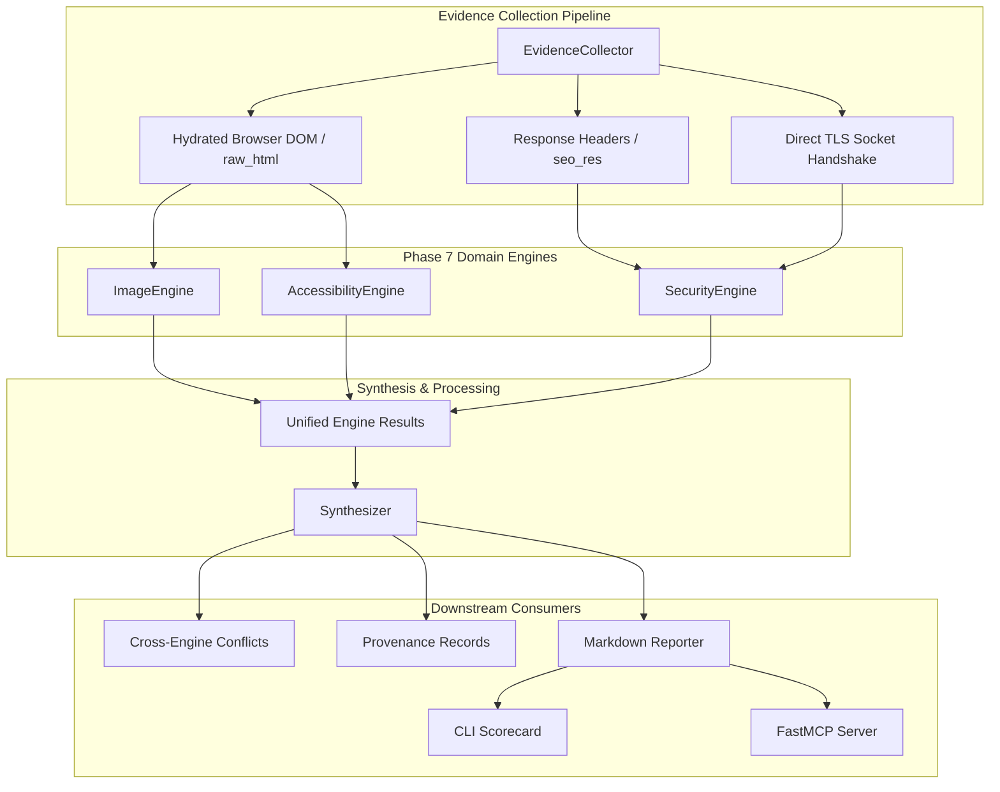

# Phase 7: Technical, Accessibility & Security Intelligence Reference

> **Phase Status:** Complete (M7.1 – M7.4)  
> **Integrated Git HEAD:** `aefc3d8`  
> **Test Baseline:** 267 unit/integration tests (`tests/`), 100 regression benchmarks (`benchmarks/test_regression.py`)

---

## 1. Phase Overview

Phase 7 expands RankIntel from SEO, GEO, and Performance intelligence into comprehensive Technical, Accessibility, and Security intelligence across four sequential milestones:

- **M7.1 — Image SEO Engine (`ImageEngine`)**: Analyzes image metadata, alt attribute semantics, intrinsic/rendered dimensions, modern format adoption (WebP, AVIF), layout shift risk indicators, and `<head>` resource preload observations.
- **M7.2 — Accessibility Engine (`AccessibilityEngine`)**: Implements dual-tier automated WCAG 2.1/2.2 AA evaluation consisting of a zero-dependency static HTML AST auditor and an optional Playwright + axe-core browser evaluation runtime.
- **M7.3 — Transport & Security Engine (`SecurityEngine`)**: Performs passive transport-layer (TLS certificate socket handshakes) and application-layer (HTTP security headers, cookie hygiene, mixed content, server disclosure) security observations.
- **M7.4 — Phase 7 Integration & Regression**: Connects all three engines into `EvidenceCollector`, `Synthesizer`, `CrossEngineConflictDetector`, provenance records, Markdown reporting, CLI scorecards, and FastMCP tools, validating zero-redundant-HTTP and scoring formula invariance.

---

## 2. Integrated Architecture

---

## 3. Engine Specifications & Boundaries

### 3.1 ImageEngine (`src/rankintel/engines/image_engine.py`)
- **Evaluates**:
  - `alt` text coverage, length, semantic quality, and generic placeholder detection.
  - Dimension hygiene: Presence of explicit HTML/CSS `width` and `height` attributes to prevent layout instability.
  - Modern format adoption: Usage of modern next-gen image codecs (WebP, AVIF, SVG) versus legacy formats (JPEG, PNG, GIF).
  - Protocol security: Identification of insecure `http://` image assets on secure pages.
  - Resource hints: Identification of preloaded or render-blocking images in `<head>`.
- **Evidence Consumed**: `raw_html` (already retrieved from headless DOM hydration or static HTTP response).
- **Explicit Boundary**: Does **NOT** claim to measure actual Core Web Vitals (CWV) Cumulative Layout Shift (CLS) scores, as true CLS requires live Chrome RUM or Lighthouse user-interaction sessions.

### 3.2 AccessibilityEngine (`src/rankintel/engines/accessibility_engine.py`)
- **Evaluation Tiers**:
  1. *Static AST Tier (`static_ast_auditor`)*: Parses HTML tags for language attributes, form input label associations, heading hierarchy, duplicate IDs, and basic ARIA roles without launching a browser.
  2. *Rendered axe-core Tier (`axe_core_playwright`)*: Injects the official axe-core evaluation runtime into the rendered Playwright browser context for automated WCAG 2.1 and WCAG 2.2 Level AA rule checks.
- **Status Semantics**: Preserves `PASS`, `FAIL`, `PARTIAL`, `UNKNOWN`, and `UNAVAILABLE`.
  - When browser rendering is blocked or disabled by anti-bot firewalls, the engine gracefully records `AccessibilityStatus.UNAVAILABLE` rather than generating false passes or crashing.
- **Explicit Boundary**: Automated accessibility tools detect approximately 30–40% of WCAG criteria. Reports strictly label findings as *"WCAG 2.1/2.2 AA automated accessibility checks"* and disclaim full legal or human WCAG certification.

### 3.3 SecurityEngine (`src/rankintel/engines/security_engine.py`)
- **Evaluates**:
  - HTTP Security Headers: `Strict-Transport-Security` (HSTS), `Content-Security-Policy` (CSP), `X-Frame-Options`, `X-Content-Type-Options`, `Referrer-Policy`, and `Permissions-Policy`.
  - Cookie Security: Flags missing `Secure`, `HttpOnly`, or `SameSite` attributes on response cookies.
  - Mixed Content: Identifies active/passive HTTP resources embedded inside HTTPS responses.
  - Server Disclosure: Audits information-leaking headers (`Server`, `X-Powered-By`, `X-AspNet-Version`).
  - Transport Layer Security (TLS): Direct socket handshake validating certificate validity dates, SAN host matching, and TLS version.
- **Passive-Only Boundary**: Operates strictly within passive inspection parameters. Zero active scanning, zero fuzzed payloads, and zero penetration testing.

---

## 4. Integration & Zero Redundant HTTP

Phase 7 adheres to strict HTTP resource efficiency:
1. **HTML & Header Reuse**: `ImageEngine` and `AccessibilityEngine` process the `raw_html` already fetched by `BrowserEngine` or `advertools`. `SecurityEngine` processes the `response_headers` already captured by the initial HTTP response.
2. **No Fallback Page GETs**: If response headers are absent or unavailable, the collector records `UNKNOWN`/`UNAVAILABLE` and **never** initiates an additional HTTP page request solely to populate security evidence.
3. **Socket Handshake**: TLS certificate checks communicate directly with the host via a standard SSL/TLS socket handshake on port 443, without issuing an HTTP `GET` request.

---

## 5. Scoring Rule & Formula Invariance

Phase 7 observations **never modify existing health score formulas**:
- The existing formula modes remain untouched:
  - `3_engine`: `0.40 * seo + 0.35 * geo + 0.25 * performance`
  - `4_engine`: `0.35 * seo + 0.30 * geo + 0.20 * browser + 0.15 * performance`
  - `5_engine`: `0.30 * seo + 0.25 * geo + 0.15 * browser + 0.15 * performance + 0.15 * cloud`
- Phase 7 does **not** introduce arbitrary letter grades, percentages, or synthetic numerical scores for security, accessibility, or image SEO.
- **Prioritized Actions Gating**:
  - Findings only enter `prioritized_actions` if they are deterministic `CRITICAL` or `HIGH` security issues (e.g. missing HSTS on production HTTPS) or `CRITICAL` accessibility issues.
  - `UNKNOWN` and `UNAVAILABLE` states **never** produce prioritized actions.

---

## 6. Verification Baseline

- **Unit & Integration Suite**: 267 passing tests (`tests/`), including 15 dedicated Phase 7 end-to-end integration tests (`test_phase7_integration.py`).
- **Regression Suite**: 100 passing tests in the permanent regression benchmark (`benchmarks/test_regression.py`).
- **Permanent 11-Site Benchmark**: Concurrently audited and verified across 11 diverse production websites:
  - `https://alephindia.in/`
  - `https://www.tcreng.com/`
  - `https://www.zaubacorp.com/`
  - `https://www.yadavmeasurements.com/`
  - `https://www.uniquemeasurement.com/`
  - `https://qualityinternational.org/`
  - `https://www.ascgroup.in/`
  - `https://www.standphillindia.in/`
  - `https://umspcs.in/`
  - `https://sqccertification.com/`
  - `https://sunrisetesting.vercel.app/`
- **Canonical Git Commit**: [`aefc3d8`](https://github.com/ZeroTrace7/RankIntel/commit/aefc3d8c5240eb76965ee4ed84cafe3f367739d2)
